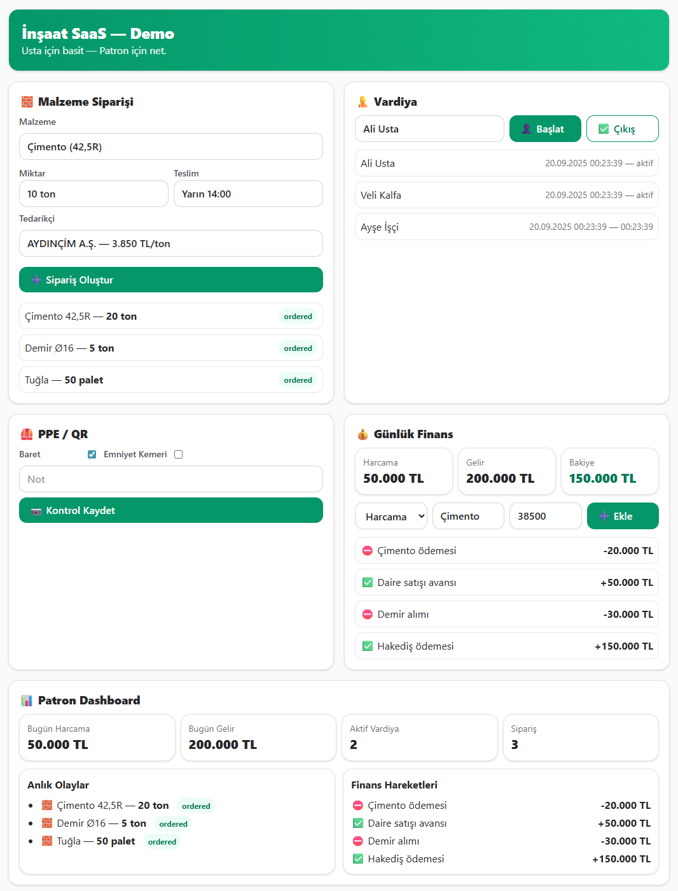

# 🏗️ İnşaat SaaS Demo / Construction SaaS Demo

Usta için basit, patron için net.  
Simple for the foreman, clear for the boss.  

---

## 🌍 About / Hakkında

**EN**  
This is a demo SaaS application designed for the construction industry.  
It provides a digital dashboard for material orders, worker shifts, safety checks (PPE), and financial tracking — all in one place. Built with **Next.js, Prisma, Neon PostgreSQL, TailwindCSS** and deployed on **Vercel**.  

**TR**  
İnşaat sektörü için tasarlanmış bir SaaS demo uygulamasıdır.  
Malzeme siparişleri, vardiya planlaması, iş güvenliği (PPE) kontrolleri ve finansal takip — hepsi tek bir ekranda.  
**Next.js, Prisma, Neon PostgreSQL, TailwindCSS** ile geliştirildi, **Vercel** üzerinde yayınlandı.

---

## ✨ Features / Özellikler

- 📦 **Orders / Siparişler** → Cement, steel, brick, etc. order management.  
- 👷 **Shifts / Vardiyalar** → Worker check-in & check-out tracking.  
- 🦺 **PPE Checks / PPE Kontrolleri** → Helmet, harness, safety compliance.  
- 💰 **Finance / Finans** → Income & expense tracking.  
- 📊 **Dashboard** → Quick project overview for managers.

---

## 🚀 Tech Stack / Teknoloji Yığını

- [Next.js 14](https://nextjs.org/) — React Framework  
- [Prisma](https://www.prisma.io/) — Database ORM  
- [Neon PostgreSQL](https://neon.tech/) — Serverless Database  
- [TailwindCSS](https://tailwindcss.com/) — Styling  
- [Vercel](https://vercel.com/) — Deployment  

---

## 🛠️ Installation / Kurulum

```bash
# Clone repo
git clone https://github.com/OrcnTester/insaat-saas.git
cd insaat-saas

# Install dependencies
npm install

# Copy env and add your Neon connection string
cp .env.example .env

# Push schema to DB
npx prisma db push

# Seed demo data
npm run db:seed

# Run locally
npm run dev
```

---

## 📸 Screenshots / Ekran Görüntüleri

<p align="center">
  
</p>

---

## 📄 License / Lisans

**EN** — MIT License. Free to use, modify, and distribute.  
**TR** — MIT Lisansı. Kullanmak, değiştirmek ve dağıtmak serbesttir.

---

## 🤝 Contributing / Katkı

Pull requests are welcome.  
Her türlü katkı ve öneri değerlidir.
