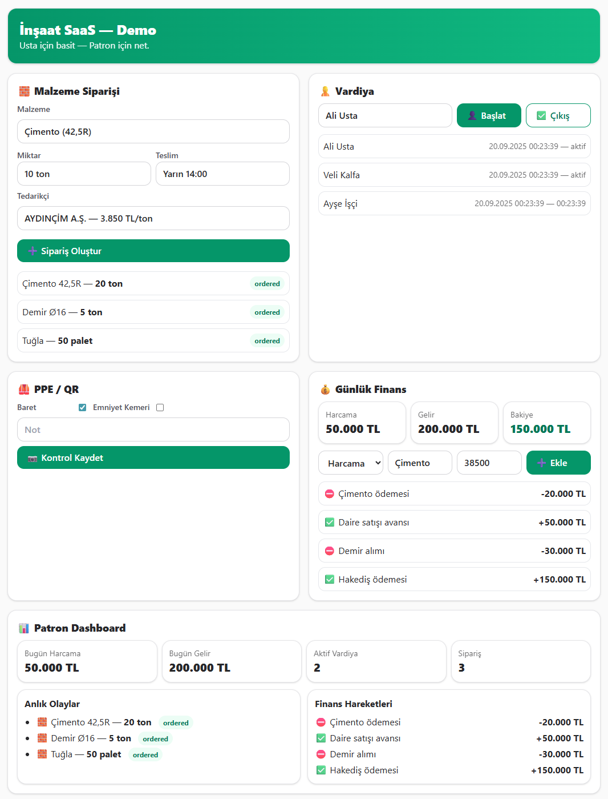

# 🏗️ Construction SaaS Demo / İnşaat SaaS Demo


<<<<<<< HEAD
Herkes için Basit, Patron için Net.\
Simple for the foreman, clear for the boss.
=======
Simple for the foreman, clear for the boss.  
Usta için basit, patron için net.
>>>>>>> feat/roles-kpis-tasks

## 🚀 Live Demo

👉 **Vercel:** https://insaat-saas.vercel.app/

---

## 🌍 About / Hakkında

**EN**  
A demo SaaS for construction operations: centralized dashboard for material orders, worker shifts, PPE safety checks, inventory, tasks, and daily finance. Built with **Next.js, Prisma, Neon PostgreSQL, TailwindCSS** and deployed to **Vercel**.

**TR**  
İnşaat operasyonları için SaaS demo: malzeme siparişleri, vardiyalar, PPE kontrolleri, stok, günlük finans ve iş planı tek ekranda. **Next.js, Prisma, Neon PostgreSQL, TailwindCSS** ile geliştirildi, **Vercel**’de çalışır.

---

## ✨ Features / Özellikler

- 📦 **Orders / Siparişler** — Create & track orders; confirm delivery.  
  **TR:** Sipariş oluştur / teslim onayla.
- 👷 **Shifts / Vardiyalar** — Worker check-in / check-out tracking.  
  **TR:** Vardiya giriş/çıkış takibi.
- 🦺 **PPE Checks / PPE Kontrolleri** — Helmet/harness compliance.  
  **TR:** Kask/halat uygunluk kontrolü.
- 📦 **Inventory & Stock Moves / Stok & Hareket** — Live inventory with IN/OUT moves.  
  **TR:** Anlık stok; giriş/çıkış kayıtları.
- 🧩 **Tasks Board (Kanban) / İş Planı** — To-Do / Doing / Done with drag-and-drop, assignee, due date.  
  **TR:** Sürükle-bırak kanban; sorumlu ve termin.
- 💰 **Finance / Finans** — Daily income/expense + running balance.  
  **TR:** Günlük gelir/gider ve bakiye.
- 🔐 **Role-based UI / Rol Bazlı UI** — Panels are permissioned; dynamic KPI is **Patron-only**.  
  **TR:** Paneller role göre açılır; dinamik KPI yalnızca **Patron** için görünür.
- 🧹 **Demo-only** — Signup removed for a cleaner demo flow.  
  **TR:** Demo sadeliği için “üye ol” kaldırıldı.

---

## 🚀 Tech Stack / Teknoloji

- [Next.js 14](https://nextjs.org/) — React Framework  
- [Prisma](https://www.prisma.io/) — Database ORM  
- [Neon PostgreSQL](https://neon.tech/) — Serverless Postgres  
- [TailwindCSS](https://tailwindcss.com/) — Styling  
- [Vercel](https://vercel.com/) — Deployment

---

## 🔑 Roles & Access / Roller & Yetki

**Roles:** `patron`, `muhasebe`, `depo`, `santiye_sefi`, `ofis`  
- **Patron:** sees dynamic KPI strip (cash balance, open orders, active sites).  
- Other roles: only their allowed panels.  
- Unauthorized API calls return **403**.

**Switching roles:** use the top role bar, or add `?role=patron` etc.  
A `role` cookie persists your choice.  
**TR:** Rol değişimi üst çubuktan veya URL ile; çerezde saklanır. Yetkisiz istekler 403 döner.

---

## 🛠️ Quick Start / Hızlı Kurulum

> Uses `pnpm`. If you prefer `npm`, adjust commands accordingly.

```bash
# 1) Clone
git clone https://github.com/OrcnTester/insaat-saas.git
cd insaat-saas

# 2) Install deps
pnpm install

# 3) Env
cp .env.example .env
# Put your Neon/Postgres connection in DATABASE_URL

# 4) DB schema
pnpm prisma db push
# or for migrations:
# pnpm prisma migrate dev --name init

# 5) Seed demo data
pnpm prisma db seed

# 6) Run dev
pnpm dev
```

**Build / Production**
```bash
pnpm build    # runs prisma generate + next build
pnpm start
```

---

## 🧪 Test Data / Demo Veri

We provide a Prisma `seed` that inserts sample customers, orders, shifts, inventory, stock moves, tasks, PPE checks, and finance transactions.  
**TR:** Seed ile örnek müşteri, sipariş, vardiya, stok, hareket, iş, PPE ve finans verileri yüklenir.

Run: `pnpm prisma db seed`

---

## 🔌 API Notes (Dev) / API Notları (Geliştirici)

- `POST /api/orders` requires a valid **ISO date** for `eta` (e.g. `new Date().toISOString()`), otherwise you’ll get a 500 “Invalid Date” error.  
  **TR:** `eta` ISO formatında olmalı (aksi halde 500).
- `GET/POST /api/tasks` uses `"TODO" | "DOING" | "DONE"`; PATCH with `/api/tasks/[id]` to update status/assignee.  
- `GET /api/finance` returns `{ expense, income, balance, txns }`.  
- `GET/POST /api/inventory` — create **Inventory** without `refType`; use **StockMove** for in/out moves.  
  **TR:** Inventory create’te `refType` gönderme; hareketler `StockMove` ile.

---

## 📸 Screenshots / Ekran Görüntüleri

<p align="center">
  
</p>

---

## ☁️ Deploy to Vercel / Vercel’e Dağıtım

1. Create a project on Vercel and link the repo.  
2. Add `DATABASE_URL` in **Project → Settings → Environment Variables**.  
3. Build command (default is fine; repo’s `build` already runs Prisma generate).  
4. Apply DB schema on deploy:
   - Recommended in prod: `prisma migrate deploy` (either as part of your build process or a one-off run).
   - For quick previews you can use `prisma db push`.
5. (Optional) Seed once from local or via a one-off script.

**TR:** Vercel’de projeyi bağla, `DATABASE_URL` ekle, build’i çalıştır. Prod’da `prisma migrate deploy` önerilir; demo için `db push` yeterli olabilir. Seed’i bir kez çalıştır.

---

## 🧰 Scripts

```json
{
  "scripts": {
    "dev": "next dev",
    "build": "prisma generate && next build",
    "start": "next start",
    "db:push": "prisma db push",
    "db:migrate": "prisma migrate dev",
    "db:seed": "prisma db seed"
  }
}
```

---

## 🐞 Troubleshooting / Sorun Giderme

- **403 from /api/** — your current role lacks permission. Switch to `?role=patron` or use the role bar.  
- **Invalid Date on order create** — ensure `eta` is ISO string (e.g. `new Date().toISOString()`).  
- **Inventory create error (`refType` unknown)** — send `refType` only when creating **StockMove**, not Inventory.  
- **Windows build hiccup after big refactors** — try removing `.next` and rebuilding.

---

## 📄 License / Lisans

**EN:** MIT — free to use, modify, and distribute.  
**TR:** MIT — kullanmak, değiştirmek ve dağıtmak serbesttir.

---

## 🤝 Contributing / Katkı

PRs are welcome.  
Katkı ve önerilere açığız.
